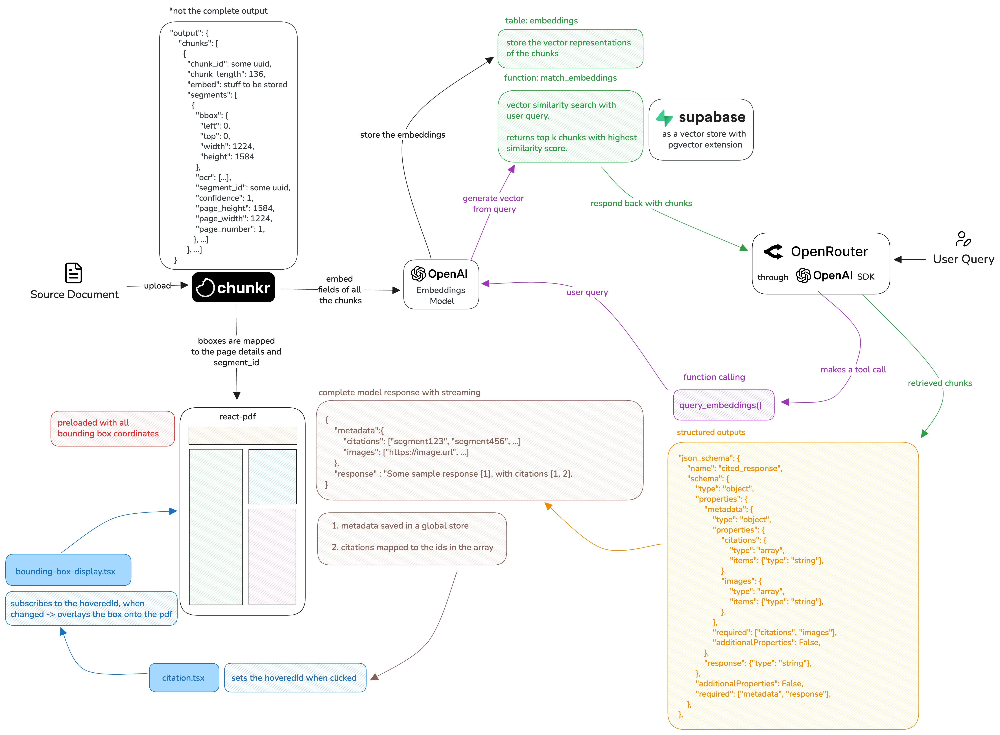

## Chunkr Chat App

This repository is the source code for the guide that you can read [here](https://chunkr.ai/blog/building-better-pdf-experiences-with-chunkr). It will cover the basic setup of the application and cover how its structured.

## Architecture

<div align="center">
  
</div>

<br/>

## Demo

<div align="center">
  
</div>

<br/>

## Setup

Clone the repository to get started. We use a monorepo structure with [pnpm](https://pnpm.io/) as the package manager and [turbo](https://turborepo.com/) as the build tool.

```bash
git clone https://github.com/lumina-ai-inc/chunkr-chat-app.git
```

Copy the `.env.example` in [apps/api](./apps/api/.env.example) file to `.env` and populate the correct values.

```bash
cp apps/api/.env.example apps/api/.env
```

## Running with Docker (Recommended)

Once you have a Docker engine running, you can run the following command from the root of the application:

```bash
cd chunkr-chat-app && docker compose up
```

This command will run three services: postgres-db (database), api (backend) and web (frontend).

## Running Without Docker

If you prefer not to use Docker, you can run the API and web applications separately. Each application has its own setup instructions:

- **API**: Handles the requests, processing the documents and generating the responses. Find the complete implementation [here](./apps/api/) and the setup instructions in [README-API](./apps/api/README-API.md)
- **Web**: Application to preview documents. Find the complete implementation of the frontend [here](./apps/web/) and the setup instructions in [README-WEB](./apps/web/README-WEB.md)

## Environment Variables

The application uses the following environment variables:

- `OPENAI_API_KEY` - used to generate embeddings from chunks.
- `OPENROUTER_API_KEY` - used to generate responses from the model.
- `CHUNKR_API_KEY` - used to process documents.

## Database

Let's kick things off by setting up our database with the required tables and the core matching functionality—used for semantic search. We use a local database instance when using Docker and [psycopg2](https://pypi.org/project/psycopg2/) a Python adadpter for PostgreSQL databases.

Alternatively, you can use a Supabase project. Head over to [Supabase](https://supabase.com/) to create a new project or spin up a [local instance](https://supabase.com/docs/guides/local-development?queryGroups=package-manager&package-manager=brew) using their command line interface.

We can connect to our database in the following way.

```python
import psycopg2

connection = psycopg2.connect(
    user=USER,
    password=PASSWORD,
    host=HOST,
    port=PORT,
    dbname=DBNAME,
    gssencmode='disable'
)

cursor = connection.cursor()
```

> NOTE: If you're using Supabase, make sure to enable the pgvector extension before trying to make a field of type vector.

We create two tables: one to store our document information and the other to store embeddings.

```python
# Create file table
cursor.execute("""
	CREATE TABLE IF NOT EXISTS public.files (
	id VARCHAR(255) PRIMARY KEY,
	file_url TEXT,
	created_at TIMESTAMP)
""")

# Create embeddings table
cursor.execute("""
	CREATE TABLE IF NOT EXISTS public.embeddings (
	id VARCHAR(255) PRIMARY KEY,
	task_id VARCHAR(255) REFERENCES public.files(id),
	content TEXT,
	embedding VECTOR(1536), -- 1536 dimensions
	created_at TIMESTAMP)
""")
```

We also index the embeddings table for faster retrieval and write a matching function to be used when querying the vectors.

```python
# Using HNSW as the algorithm
cursor.execute("""
	CREATE INDEX IF NOT EXISTS embeddings_idx
	ON public.embeddings
	USING hnsw (embedding vector_cosine_ops)
""")

# Matching function
cursor.execute("""
	CREATE OR REPLACE FUNCTION public.match_embeddings(
	    query_embedding vector(1536),     -- Input query embedding vector
	    match_threshold float,            -- Minimum similarity threshold
	    match_count integer,              -- Number of top matches to return
	    input_task_id text                -- Filter matches
	)
	RETURNS TABLE (
	    id varchar(255),                  -- ID of the matching chunk
	    content text,                     -- Text content of the chunk
	    similarity float                  -- Similarity score
	)
	LANGUAGE plpgsql
	AS $$
	BEGIN
	    RETURN QUERY
	    SELECT
	        e.id,
	        e.content,
	        1 - (e.embedding <=> query_embedding) AS similarity
	    FROM
	        public.embeddings e
	    WHERE
	        e.task_id = input_task_id
	        AND 1 - (e.embedding <=> query_embedding) > match_threshold
	    ORDER BY
	        similarity DESC
	    LIMIT match_count;
	END;
	$$;
""")
```

Complete code for this section can be found in [db.py](./apps/api/src/db.py). The database is initialized when the application at [main.py](./apps/api/src/main.py) is run.

If using Supabase, using their [Python client](https://supabase.com/docs/reference/python/introduction) is recommended. We have commented out the code that uses the client in [upload.py](./apps/api/src/routes/upload.py) and [tools.py](./apps/api/src/tools.py).
