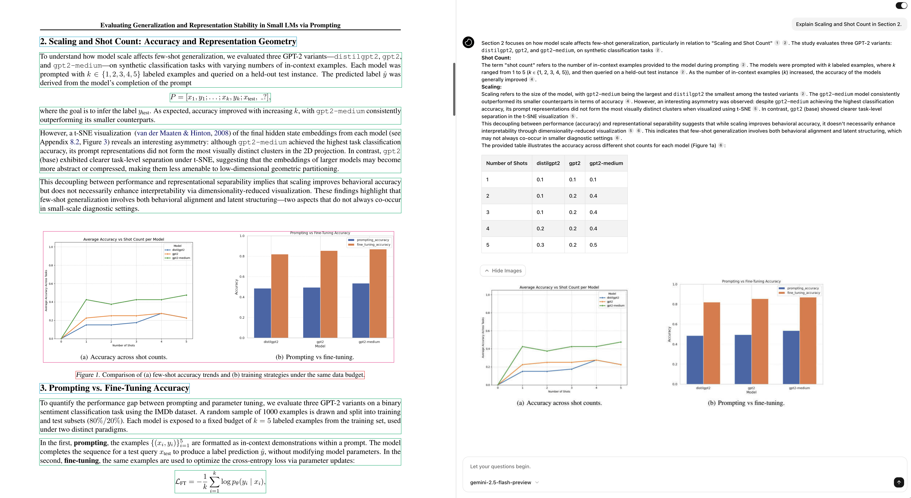

# Evidence-Based LLM Applications with Granular Document Intelligence

Language models speak confidently but often without evidence. Responses are generated based on their training data and the context provided. Even with extensive context, this doesn't solve the fundamental problem: users receive confident-sounding answers but have no way to understand where the information originated from.

The need for verified responses grew critical with the adoption of these models. Current approaches provide either generic document-level references or text snippets that lose important context. Users are left to manually search through sources, making the process tedious.

How can we make these outputs more reliable?

The solution is traceable citations that connect every piece of generated content directly to its source. Precise bounding boxes that highlight exact locations combined with semantic chunking for information dense responses makes this possible. Instead of treating documents as black boxes, we need methods that understand structure.

Today we will introduce an end-to-end solution that allows for complete visibility into the nooks and crannies of the source document.

<div align="center">
  
</div>
<div align="center">
  
</div>

## How it works?

Here's a high level overview of what will be covered in this guide:

&ndash; [Set up the database](#database-setup)

&ndash; [Document Processing using Chunkr](#document-processing-using-chunkr)

&ndash; [Store and Generate Embeddings](#embedding-generation)

&ndash; [Model Responses with Tool Calling](#response-generation)

&ndash; [Putting It All Together](#putting-it-all-together)

## Database Setup

Let's kick things off by setting up our database with the required tables and the core matching functionality—used for semantic search. Head over to [Supabase](https://supabase.com/) to create a new project or spin up a [local instance](https://supabase.com/docs/guides/local-development?queryGroups=package-manager&package-manager=brew).

Once we have a Supabase project setup or have it running locally, we can connect to it using the following code:

```python
import psycopg2

connection = psycopg2.connect(
    user=USER,
    password=PASSWORD,
    host=HOST,
    port=PORT,
    dbname=DBNAME,
    gssencmode='disable'
)

cursor = connection.cursor()
```

We will also create a Supabase [Python client](https://supabase.com/docs/reference/python/introduction) that we can use to interact with the database. We create two separate tables - one to store our document information and the other to store embeddings.

> NOTE: Since we’re making use of the pgvector extension make sure to enable it before trying to make a field that is of type vector.

```python
# Create file table
cursor.execute("""
	CREATE TABLE IF NOT EXISTS public.files (
	id VARCHAR(255) PRIMARY KEY,
	file_url TEXT,
	created_at TIMESTAMP)
""")

# Create embeddings table
cursor.execute("""
	CREATE TABLE IF NOT EXISTS public.embeddings (
	id VARCHAR(255) PRIMARY KEY,
	task_id VARCHAR(255) REFERENCES public.files(id),
	content TEXT,
	embedding VECTOR(1536), -- 1536 dimensions
	created_at TIMESTAMP)
""")
```

Finally, we index the embeddings table for faster retrieval and write a matching function to be used when querying the vectors.

```python
# Using HNSW as the algorithm
cursor.execute("""
	CREATE INDEX IF NOT EXISTS embeddings_idx
	ON public.embeddings
	USING hnsw (embedding vector_cosine_ops)
""")

# Matching function
cursor.execute("""
	CREATE OR REPLACE FUNCTION public.match_embeddings(
	    query_embedding vector(1536),     -- Input query embedding vector
	    match_threshold float,            -- Minimum similarity threshold
	    match_count integer,              -- Number of top matches to return
	    input_task_id text                -- Filter matches
	)
	RETURNS TABLE (
	    id varchar(255),                  -- ID of the matching chunk
	    content text,                     -- Text content of the chunk
	    similarity float                  -- Similarity score
	)
	LANGUAGE plpgsql
	AS $$
	BEGIN
	    RETURN QUERY
	    SELECT
	        e.id,
	        e.content,
	        1 - (e.embedding <=> query_embedding) AS similarity
	    FROM
	        public.embeddings e
	    WHERE
	        e.task_id = input_task_id
	        AND 1 - (e.embedding <=> query_embedding) > match_threshold
	    ORDER BY
	        similarity DESC
	    LIMIT match_count;
	END;
	$$;
""")
```

Complete code for this section can be found [here](./apps/api/src/db.py).

## Document Processing using Chunkr

Now that we have our database set up, we can start processing the documents. We will make use of the [Chunkr Python SDK](https://docs.chunkr.ai/sdk/installation) to generate RAG-ready chunks.

### 1. Setting up a Config

Chunkr provides a default Configuration object that works well out of the box—but it's also highly customizable. To get better control and alignment with our embedding model, we’ll tweak a few parameters.

```python
Configuration(
chunk_processing=ChunkProcessing(
    ignore_headers_and_footers=True,
    target_length=1024,
    tokenizer=Tokenizer.CL100K_BASE,
))
```

In this example, we've increased the `target_length` to allow for larger chunks and a `CL100K_BASE` tokenizer which matches the one used by our embedding model.

Read more about chunking and tokenization [here](https://docs.chunkr.ai/docs/features/chunking).

### 2. Segment Processing

Each chunk produced by Chunkr is composed of multiple segments—smaller units that can represent text, images, tables, or other elements. These segment configurations are fully customizable, allowing you to fine-tune how each content type is processed.

For example, if you want to embed image content but also run a custom prompt on each image to extract insights, you can configure the `Picture` segment like this:

```python
Picture=GenerationConfig(
        crop_image=CroppingStrategy.ALL,
        html=GenerationStrategy.LLM,
        llm="Convert the images to tables and add an analysis of the values in the description",
        markdown=GenerationStrategy.LLM,
        embed_sources=["LLM", "Markdown"],
        extended_context=True
)
```

You can dive deeper into segment-level customization [here](https://docs.chunkr.ai/docs/features/segment-processing#understanding-the-configuration). The complete configuration we use for this guide can be found at [chunkr_config.py](./apps/api/src/chunkr_config.py).

### 3. Creating a Task

Now we can create a task that will process any given document.

```python
from chunkr_ai import Chunkr
from chunkr_ai.models import *

chunkr = Chunkr()

# Create a configuration
chunkr_config = Configuration(
chunk_processing=ChunkProcessing(
     ignore_headers_and_footers=True,
     target_length=1024,
     tokenizer=Tokenizer.CL100K_BASE,
),
segment_processing=SegmentProcessing(
     Picture=GenerationConfig(
        crop_image=CroppingStrategy.ALL,
        html=GenerationStrategy.LLM,
        llm="Convert the images to tables and add an analysis of the values in the description",
        markdown=GenerationStrategy.LLM,
        embed_sources=["LLM", "Markdown"],
        extended_context=True
    )
))

# Upload and wait for complete processing with the custom configuration
task = chunkr.upload("path/to/your/file", config=chunkr_config)

# Or we can make use of create_task method to not wait for the task to complete using a default configuration
task = chunkr.create_task("path/to/your/file")

print(task.output.chunks) # Contains the processed chunks
```

## Embedding Generation

The next step is to generate embeddings for the resultant chunks. We will use [OpenAI Embeddings](https://platform.openai.com/docs/api-reference/embeddings) to help us do this.

```python
import openai
import tiktoken
from supabase import create_client

supabase = create_client(os.getenv("SUPABASE_URL"), os.getenv("SUPABASE_KEY"))

valid_chunks = []

for chunk in task.output.chunks:
    chunk_text = chunk.embed.strip()

    # Skip empty strings
    if not chunk_text:
        continue

    token_count = len(tiktoken.get_encoding("cl100k_base").encode(chunk_text))

    if token_count <= 8191:
        valid_chunks.append({
            'chunk': chunk,
            'text': chunk_text,
        })
    else:
        # Don't skip but strip the chunk to the token limit
        chunk_text = chunk_text[:8191]
        valid_chunks.append({
            'chunk': chunk,
            'text': chunk_text,
        })

    # Extract text from valid chunks for embeddings
    chunk_texts = [chunk['text'] for chunk in valid_chunks]

    # Batch generate embeddings using OpenAI
    embedding_response = openai.embeddings.create(
        model="text-embedding-3-small",
        input=chunk_texts
    )

    # Prepare batch upsert data
    embeddings_data = []

    for i, chunk_data in enumerate(valid_chunks):
        chunk = chunk_data['chunk']
        embeddings_data.append({
            "id": chunk.chunk_id,
            "content": chunk_data['text'],
            "embedding": embedding_response.data[i].embedding,
            "task_id": task.task_id,
            "created_at": datetime.now().isoformat()
        })

    # Batch upsert to Supabase <- This is where the Supabase client comes in handy
    supabase.table("files").insert({
        "id": task.task_id,
        "file_url": task.output.pdf_url,
        "created_at": datetime.now().isoformat()
    }).execute()

    supabase.table("embeddings").upsert(embeddings_data).execute()
```

We generate embeddings for all the chunks simultaneously while ensuring the token count stays within the model's limit. After this, we simply upsert the relevant data into our database.

Find the complete implementation of the pipeline [here](./apps/api/src/routes/upload.py).

## Response Generation

The final step is implementing response generation. We use the [OpenAI Python SDK](https://github.com/openai/openai-python) configured with [OpenRouter](https://openrouter.ai/) for flexibility across different model providers. However, there's a fundamental challenge: the model has no inherent way to access the document content we've processed.

This is where [function calling](https://platform.openai.com/docs/guides/function-calling) comes in. Using our semantic search function combined with the outputs from Chunkr, we have set up some basic functions at [tools.py](./apps/api/src/tools.py). These functions enable the model to pinpoint to the exact segment that it needs to reference. Although, the function can be easily edited to return a chunk-based response.

However, challenges extend beyond basic retrieval. We need to make sure the model always responds in a predictable format. Also, we need a foolproof way to handle in-line citations that prevents unwanted information in the final response.

Fortunately, we can handle all of this elegantly using [structured outputs](https://platform.openai.com/docs/guides/structured-outputs). Here is a basic schema that we use for this guide:

```python
{
    "type": "json_schema",
    "json_schema": {
        "name": "cited_response",
        "schema": {
            "type": "object",
            "properties": {
                "metadata": {
                    "type": "object",
                    "properties": {
                        "citations": {"type": "array", "items": {"type": "string"}},
                        "images": {"type": "array", "items": {"type": "string"}}
                    },
                    "required": ["citations", "images"],
                    "additionalProperties": False
                },
                "response": {"type": "string"}
            },
            "additionalProperties": False,
            "required": ["metadata", "response"]
        }
    }
}
```

To take the user experience even further, all function calls and the final response are streamed to the frontend. Read more on how to handle [streaming responses](https://platform.openai.com/docs/guides/streaming-responses?api-mode=chat). We handle streaming in the [streaming-response-handler.ts](./apps/web/src/helpers/streaming-response-handler.ts) file.

Find the complete implementation of the response generation flow [here](./apps/api/src/routes/generate.py).

## Putting It All Together

To bring everything together, we use a simple React application set up with [Next.js](https://nextjs.org/) and [react-pdf](https://github.com/wojtekmaj/react-pdf) to preview documents.

A simple `GET` request returns the task results to the frontend where we extract bounding box coordinates for each segment. We then associate them with their `segment_id` and page details.

Here is a snippet of how it looks:

```javascript
const res = await fetch(`${process.env.NEXT_PUBLIC_API_URL}/api/task/${taskId}`,{ method: 'GET' })

const data = await res.json()
const task: TaskResponse = data.task
const chunks: Chunk[] = task.output?.chunks || []

const bboxes = useMemo(() => {
    const allBboxes: Array<{
      bbox: BoundingBox & { page_number: number }
      id: string
      page_width: number
      page_height: number
    }> = []
    chunks.forEach((chunk) => {
      chunk.segments.forEach((segment) => {
        allBboxes.push({
          bbox: {
            ...segment.bbox,
            page_number: segment.page_number,
          },
          id: segment.segment_id,
          page_width: segment.page_width,
          page_height: segment.page_height,
        })
      })
    })
    return allBboxes
  }, [chunks])
```

Rendering for bounding boxes is handled by a lightweight component called [bounding-box-display.tsx](./apps/web/src/components/chat/bounding-box-display.tsx). The component could also be configured to render chunk-based boxes instead of segment-based ones.

Find the complete implementation of the frontend [here](./apps/web/).

## Conclusion

You now have a complete evidence-based LLM application! The system provides precise citations with bounding boxes and enhances model responses with relevant information-text, images, and tables. This should serve as a solid starting point to build on top of.

Check out the demo video to see the application in action.

Find the complete source code for this guide on GitHub [here](https://github.com/lumina-ai-inc/chunkr-chat-app).
